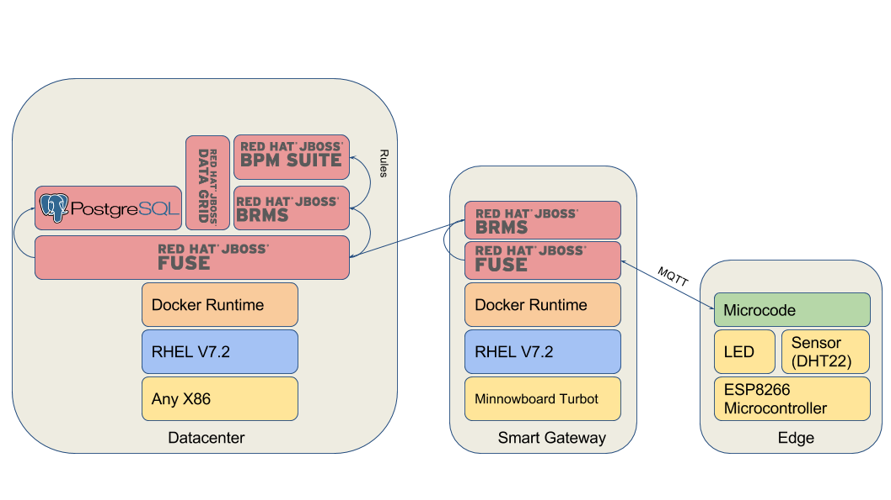

= IoT Demo - Datacenter

:Author:    Patrick Steiner
:Email:     psteiner@redhat.com
:Date:      23.01.2016

:toc: macro

toc::[]

== Purpose
This repository is part of a series of three, which in combination resemble an
Internet of Things ( IoT ) demo-environment, based on the 3-Layered architecture of

* https://github.com/PatrickSteiner/IoT_Demo_Sensors[Edge / Sensors]: creation of data
* https://github.com/PatrickSteiner/IoT_Demo_Gateway[Smart Gateway / Controller]: first level of data processing
* https://github.com/PatrickSteiner/IoT_Demo_Datacenter[Datacenter]: well, the datacenter ...

These layers can - and in this demo will - be made out of a set of
Red Hat JBoss products, each taking over an important part in the IoT landscape



== Datacenter
The Datacenter is the part of the demo, where the data from the sensors is

* stored in a Postgres-DB
* validated against rules for alterting
* creates a BPM Process if needed

== Architecture
=== Running on dedicated hardware
The Datacenter is build based on the following technologies

* Intel X86
* Any system capable of running Docker. I'm using a Macbook with https://docs.docker.com/machine/install-machine/[docker-machine]
* Docker-Compose available on the docker-host
* https://access.redhat.com/jbossnetwork/restricted/softwareDownload.html?softwareId=48541[JBoss Fuse] for the required messaging and integration capabilities.
* https://access.redhat.com/jbossnetwork/restricted/softwareDownload.html?softwareId=41161[JBoss BPM Suite] for the process management
* https://access.redhat.com/jbossnetwork/restricted/softwareDownload.html?softwareId=42191[JBoss DataGrid] to hot-store information

WARNING: If you should use docker-machine on Mac OS X, like I am, then you will have to increase the size of the Virtualbox VM, running
in the background of docker-machine.
```
MacBook-Pro:~ psteiner$ docker-machine rm default
Do you really want to remove "default"? (y/n): y
(default) Stopping VM...
Successfully removed default
MacBook-Pro:~ psteiner$ docker-machine create -d virtualbox --virtualbox-memory 10192 --virtualbox-cpu-count 2 default
```

== Build, Configure and Run the Datacenter
=== Preparation Steps
To be able to run the Smart Gateway, as proposed here, you will have to prepare the following

* git
* Maven ( I'm on V 3.3.9 )
* Docker ( I'm running docker-machine V1.9.1 )
* docker-compose ( I'm running V1.5.2 )
* network access to your https://github.com/PatrickSteiner/IoT_Demo_Gateway/tree/Minnowboard[Demo-Gateway]

With all this prepared, all you need to do is to to clone the repo

```
pi@gateway:~ $ cd
pi@gateway:~ $ git clone -b Minnowboard https://github.com/PatrickSteiner/IoT_Demo_Datacenter.git
```

After cloning the repo, you will have to download and put

* https://access.redhat.com/jbossnetwork/restricted/softwareDownload.html?softwareId=37393[JBoss EAP V6.4.0] into directory `./IoT_Demo_Datacenter/bpm/Docker_Files/software/`
* https://access.redhat.com/jbossnetwork/restricted/softwareDownload.html?softwareId=42471&product=appplatform[JBoss EAP V6.4.6-patch] into directory `./IoT_Demo_Datacenter/bpm/Docker_Files/software/`
* https://access.redhat.com/jbossnetwork/restricted/softwareDownload.html?softwareId=41161[JBoss BPM Suite] into directory `./IoT_Demo_Datacenter/bpm/Docker_Files/software/`
* https://access.redhat.com/jbossnetwork/restricted/softwareDownload.html?softwareId=48541[JBoss Fuse on Karaf] into directory `./IoT_Demo_Datacenter/Fuse/Docker_Files/software/`
* https://access.redhat.com/jbossnetwork/restricted/softwareDownload.html?softwareId=42191[JBoss DataGrid] into directory `./IoT_Demo_Datacenter/DataGrid/Docker_Files/software/`
* https://access.redhat.com/jbossnetwork/restricted/softwareDownload.html?softwareId=42331[JBoss Data Grid 6.6.0 Library Module for JBoss EAP 6] into directory `./IoT_Demo_Datacenter/bpm/Docker_Files/software/`


=== Building the Datacenter
After cloneing, you only need to enter the newly created directory and run the `build.sh` script.
```
pi@gateway:~ $ cd IoT_Demo_Datacenter
pi@gateway:~ $ ./build.sh
```

=== Configure Environment
Before you can start the Smart Gateway, you will have to do a small configuration task.
This is required, as the Smart Gateway is designed to be flexible about the surrounding
environment.

Please do open the file 'docker-compose.yml' in your favorite editor and change the
entries which define the environment variables for the messaging broker IP addresses and
ports

* In section `rules`

  ** `SOURCE_AMQ_BROKER` is the fully qualified URL for the ActiveMQ Broker from which Rules will receive messages. You will usually be able to leave this as it is.
  ** `TARGET_MQTT_BROKER` is the fully qualified URL for the MQTT Broker where Rules will deliver messages. This is usually the ip-address of your Gateway.
  ** `SOURCE_QUEUE` name of queue on `SOURCE_AMQ_BROKER` where Rules will receive messages from. Should be `message.to.rules`
  ** `TARGET_QUEUE` name of queue on `TARGET_AMQ_BROKER` where Rules will deliver messages to. Should be `message.to.datacenter`
  ** `BROKER_ADMIN_UID` the user-id of the user which authenticates at the Gateway. In the demo-setup this will usually be `admin`
  ** `BROKER_ADMIN_PASSWD` the password for the user. This will usually be `change12_me` in the default demo setup.

Once you changed these values, you are ready to go.

=== Start Environment
Start the Datacenter with

```
pi@gateway:~ $ cd IoT_Demo_Datacenter/
pi@gateway:~/IoT_Demo_Datacenter $ docker-compose up -d
```

To "monitor" the startup or runtime of the Datacenter you can use the command

```
pi@gateway:~/IoT_Demo_Datacenter $ docker-compose logs
bpm_1          | 12:28:55,900 INFO  [org.jboss.as] (Controller Boot Thread) JBAS015951: Admin console listening on http://0.0.0.0:9990
bpm_1          | 12:28:55,901 INFO  [org.jboss.as] (Controller Boot Thread) JBAS015874: JBoss EAP 6.4.0.GA (AS 7.5.0.Final-redhat-21) started in 98012ms - Started 1106 of 1143 services (82 services are lazy, passive or on-demand)
```

Once you see these messages, you are good to go!
